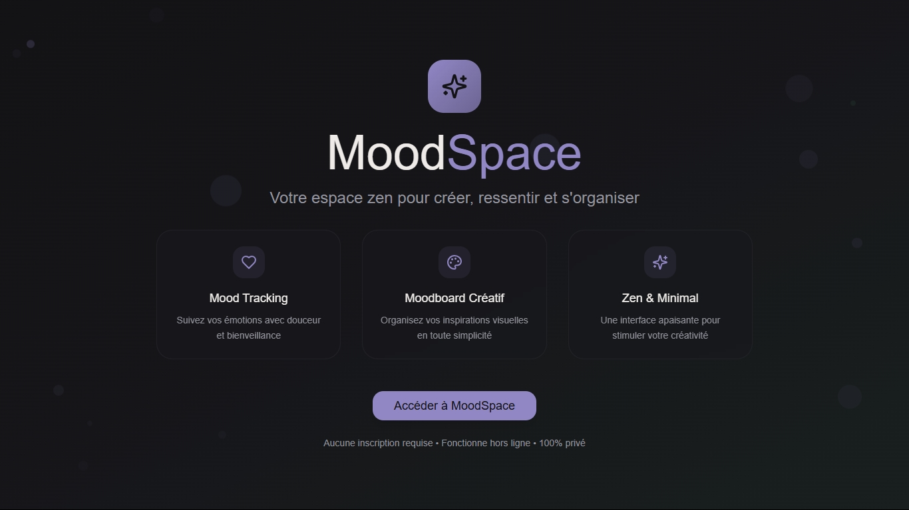

# ☄️ Plateforme MoodSpace

L'application MoodSpace est une plateforme de bien-être qui permet d'extérioriser ses sentiments. Elle offre un environnement simple et stimulant pour explorer les émotions, rester organisé, et libérer la créativité au quotidien.

### ✨ [Live Demo](https://mood-space-app.vercel.app)

---

## 🚀 Fonctionnalités

- Discussion avec une IA integrée concernant vos ressentis
- Suivie de votre humeur tout au long de la semaine
- Collection de vos inpirations visuelles (Moodboard)
- Création de cartes esthetiques personnalisées
- Petite Todo liste pour vos tâches quotidiennes
- Mise en place d'un Pomodoro pour rester efficace

## 📷 Aperçu

